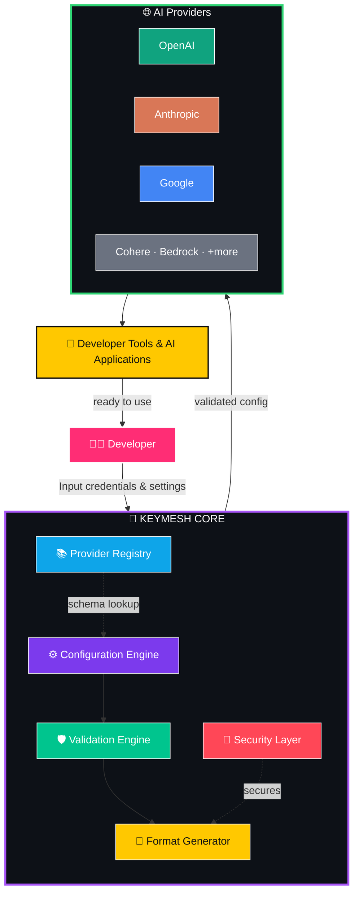
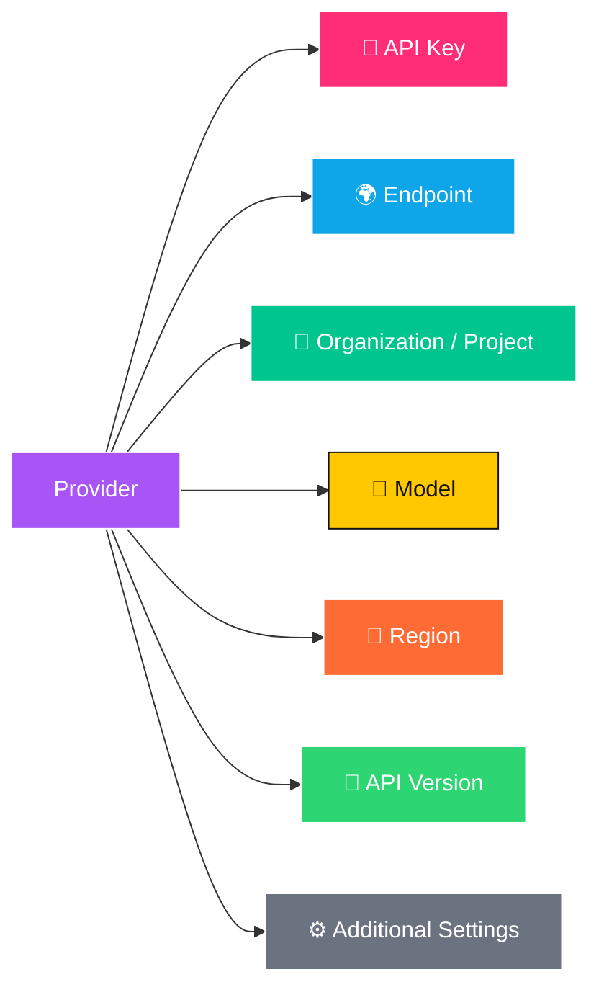
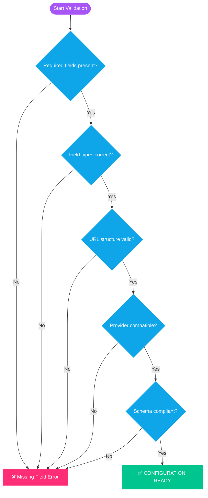
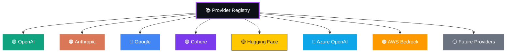
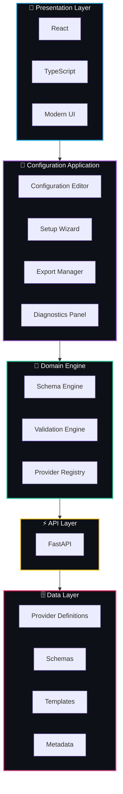
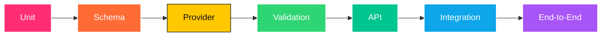
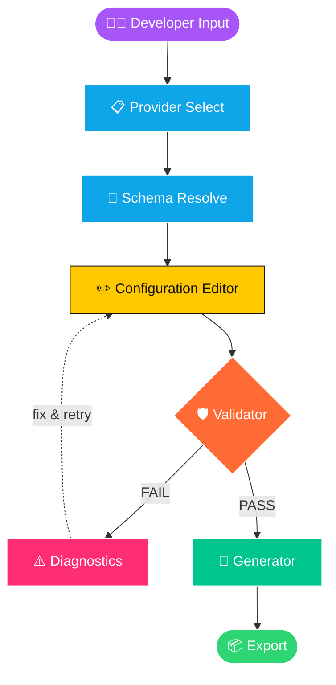
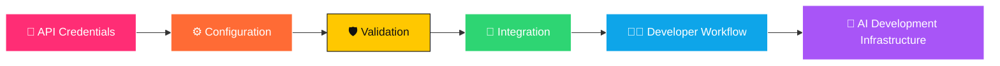

<div align="center">


# KEY-MESH

### *The Intelligent API Configuration & Integration Assistant*

**Configure once. Validate confidently. Build faster.**

<br/>

[](#)
[](#)
[](#-license)
[](#)
[](#-contributing)

[](#)
[](#)
[](#)
[](#)
[](#)
[](#)

<br/>

**[Overview](#-what-is-keymesh)** · **[Features](#-core-features)** · **[Architecture](#%EF%B8%8F-system-architecture)** · **[Install](#-getting-started)** · **[Roadmap](#%EF%B8%8F-roadmap)** · **[Contribute](#-contributing)**

</div>

<br/>

---

## 🎬 What is Keymesh?

Working with modern AI APIs *looks* simple on the surface:

```
API Key  →  Configuration  →  Application
```

The reality is messier. Every provider — OpenAI, Anthropic, Google, Cohere, Bedrock — expects a different shape of truth:

<div align="center">

| ⚠️ Common Failure | Impact |
|:--|:--|
| Wrong environment-variable names | Silent authentication failure |
| Mismatched JSON structures | Broken deployments |
| Provider-specific formats | Copy-paste doesn't work across tools |
| Invalid endpoint URLs | Runtime connection errors |
| Incorrect model identifiers | Requests rejected by the API |
| Missing required fields | Cryptic validation errors |
| Inconsistent tool configs | Hours lost debugging, not building |

</div>

**Keymesh** sits between you and that chaos — a structured, validated, provider-aware configuration layer that turns fragile copy-paste text into reliable engineering data.

<br/>

## 🏗️ System Architecture



<br/>

## 🚀 Keymesh v1.0.0 — First Public Release

> **Discoverable → Structured → Validated → Generated → Exportable**

<div align="center">

| 🎯 Goal | Description |
|:--|:--|
| 🔑 **API Configuration** | Configure providers through a guided interface |
| 🧩 **Provider Support** | Maintain provider-specific configuration schemas |
| 📝 **JSON Generation** | Generate correctly structured configuration files |
| 🛡️ **Validation** | Detect common configuration mistakes before export |
| 🔎 **Diagnostics** | Explain configuration problems clearly |
| 📦 **Export** | Produce ready-to-use configuration output |
| 🔄 **Portability** | Move configurations easily between environments |
| 🎨 **Developer UX** | A modern, professional configuration experience |

</div>

<br/>

## 🌟 Core Features

### 🔑 1 · API Key Configuration

A structured workflow for entering credentials and related settings.



---

### 🧠 2 · Provider-Aware Configuration

Different providers don't share the same authentication mechanism, environment variables, endpoint structure, model naming, or schema. Keymesh treats provider configuration as **schema-driven data**, never a one-size-fits-all assumption.

---

### 🧩 3 · Configuration Schema Engine

Every provider is represented as a structured, machine-readable schema:

```json
{
  "provider": "example-provider",
  "version": "1",
  "authentication": {
    "type": "api_key",
    "field": "api_key"
  },
  "fields": [
    { "name": "api_key", "type": "secret", "required": true },
    { "name": "endpoint", "type": "url", "required": true },
    { "name": "model", "type": "string", "required": true }
  ]
}
```

This allows Keymesh to *understand* what a configuration means — not just generate arbitrary JSON.

---

### 🛡️ 4 · Configuration Validation



---

### 🔎 5 · Configuration Diagnostics

Instead of a bare error, Keymesh explains **what's wrong and how to fix it**:

```text
⚠ CONFIGURATION ISSUE

The selected provider requires an endpoint,
but no endpoint has been configured.

→ Recommended action:
  Add the provider endpoint before exporting.
```

---

### 📄 6 · JSON Configuration Generator

```json
{
  "provider": "provider-name",
  "apiKey": "${API_KEY}",
  "endpoint": "https://api.example.com",
  "model": "model-name"
}
```

The exact structure adapts to the selected provider and target format.

---

### 🌍 7 · Multi-Provider Architecture



New providers plug into the registry without touching core application logic.

---

### 🧰 8 · Target Configuration Formats

<div align="center">

| Format | Use Case |
|:--|:--|
| `.env` | Environment variables for local/server apps |
| `JSON` | Structured application configuration |
| `YAML` | Infrastructure & CI/CD pipelines |
| App Config | Native application settings |
| AI Tool Config | AI development tools & IDE integrations |

</div>

---

### 💻 9 · Developer Tool Integration

Built with AI development workflows in mind — AI coding environments, desktop AI clients, IDEs, CLIs, local and cloud AI applications, and custom tooling — reducing configuration friction everywhere.

<br/>

## 🏛️ Artifact & Layer Architecture



<br/>

## 🧱 Technology Stack

<div align="center">

### Frontend

[](#)
[](#)
[](#)
[](#)
[](#)

### Backend

[](#)
[](#)
[](#)
[](#)

### Configuration Engine

[](#)
[](#)
[](#)
[](#)
[](#)

</div>

<br/>

## 📁 Project Structure

```text
keymesh/
│
├── apps/
│   ├── web/
│   │   ├── src/
│   │   ├── components/
│   │   ├── pages/
│   │   └── features/
│   │
│   └── api/
│       ├── app/
│       ├── routers/
│       ├── services/
│       └── models/
│
├── packages/
│   ├── schemas/
│   ├── providers/
│   ├── validators/
│   └── config-engine/
│
├── providers/
│   ├── openai/
│   ├── anthropic/
│   ├── google/
│   └── ...
│
├── tests/
├── docs/
│
├── .env.example
├── README.md
├── LICENSE
└── package.json
```

<br/>

## ⚡ Getting Started

<table>
<tr><td>

**1 · Clone the repository**

```bash
git clone https://github.com/your-username/keymesh.git
cd keymesh
```

**2 · Install frontend dependencies**

```bash
npm install
```

**3 · Install backend dependencies**

```bash
python -m venv .venv
```

*Windows*
```powershell
.venv\Scripts\Activate.ps1
```

*Linux / macOS*
```bash
source .venv/bin/activate
```

```bash
pip install -r requirements.txt
```

</td></tr>
</table>

## ▶️ Run Development Environment

<div align="center">

| Service | Command |
|:--|:--|
| 🎨 Frontend | `npm run dev` |
| ⚡ Backend | `uvicorn app.main:app --reload` |

</div>

> Exact commands may change according to final repository structure.

<br/>

## 🔐 Security

API credentials are sensitive information. Keymesh follows a **security-first configuration philosophy**.


**Recommended pattern** — instead of embedding a raw secret:

```json
{ "apiKey": "actual-secret-key" }
```

Prefer an environment reference:

```json
{ "apiKey": "${API_KEY}" }
```

> ⚠️ **Never** commit real API keys, access tokens, passwords, or other secrets to Git repositories.

<br/>

## 🧪 Testing

<div align="center">

| Layer | Command |
|:--|:--|
| Frontend | `npm test` |
| Backend | `pytest` |

</div>



<br/>

## 📊 Configuration Pipeline



<br/>

## 🏆 Why Keymesh?

<table>
<tr>
<th align="center">😩 Traditional Configuration</th>
<th align="center">✨ With Keymesh</th>
</tr>
<tr>
<td valign="top">

```text
Search documentation
       ↓
Copy API key
       ↓
Find configuration example
       ↓
Modify JSON
       ↓
Guess field names
       ↓
Run application
       ↓
Error
       ↓
Debug configuration
```

</td>
<td valign="top">

```text
Select Provider
       ↓
Configure
       ↓
Validate
       ↓
Diagnose
       ↓
Generate
       ↓
Export
       ↓
Use
```

</td>
</tr>
</table>

<div align="center">

> ### *"Configuration should be treated as structured, validated engineering data — not fragile copy-paste text."*

</div>

<br/>

## 🎨 Design Philosophy

<div align="center">

🌈 Vibrant Visual Hierarchy &nbsp;·&nbsp; 🧊 Clean Cards & Panels &nbsp;·&nbsp; ⚡ Fast Interactions
🧠 Intelligent Guidance &nbsp;·&nbsp; 🛡️ Security-Conscious UX &nbsp;·&nbsp; 🧩 Modular Architecture
🌙 Dark-Mode Friendly &nbsp;·&nbsp; 📱 Responsive Design &nbsp;·&nbsp; ♿ Accessible Components

</div>

<br/>

## 🗺️ Roadmap

<table>
<tr><td>

### 🟣 v1.0.0 — Foundation
- [x] Initial Keymesh architecture
- [x] Provider-oriented configuration model
- [x] Configuration editor foundation
- [x] Schema-based configuration
- [x] Validation architecture
- [x] JSON generation foundation
- [x] Modern developer UI
- [x] Initial documentation

</td><td>

### 🔵 v1.1 — Expansion
- [ ] Expanded provider registry
- [ ] More configuration formats
- [ ] Improved diagnostics
- [ ] Configuration templates
- [ ] Import existing configurations
- [ ] Configuration comparison

</td></tr>
<tr><td>

### 🟢 v1.2 — Intelligence
- [ ] Advanced configuration validation
- [ ] Provider capability detection
- [ ] Environment management
- [ ] Configuration profiles
- [ ] Better IDE integration

</td><td>

### 🟠 v2.0 — Ecosystem
- [ ] Extension architecture
- [ ] Community provider definitions
- [ ] Advanced developer-tool integrations
- [ ] Automated configuration migration
- [ ] Configuration health monitoring
- [ ] Enterprise configuration management

</td></tr>
</table>

<br/>

## 🤝 Contributing

Contributions are welcome — here's the typical workflow:

```bash
git checkout -b feature/my-feature
# make your changes, then:
git add .
git commit -m "feat: add my feature"
git push origin feature/my-feature
```

Then open a Pull Request. 🎉

<br/>

## 📜 Versioning

Keymesh follows **Semantic Versioning** — `MAJOR.MINOR.PATCH`

<div align="center">

```
v1 . 0 . 0
   │   │   │
   │   │   └── PATCH — Bug fixes & small improvements
   │   └────── MINOR — New backward-compatible functionality
   └────────── MAJOR — Breaking architectural or API changes
```

</div>

<br/>

## 🏷️ Release — v1.0.0

<div align="center">

[](#)
[](#)
[](#)

</div>

**Release highlights**

🔐 Secure configuration foundation &nbsp;·&nbsp; 🧩 Provider-aware architecture &nbsp;·&nbsp; 📝 Configuration generation
🛡️ Validation engine &nbsp;·&nbsp; 🔎 Diagnostics foundation &nbsp;·&nbsp; 🎨 Modern developer interface
🏗️ Extensible architecture &nbsp;·&nbsp; 📚 Initial documentation

<br/>

## 📄 License

Keymesh is released under the **MIT License** — see [`LICENSE`](LICENSE) for details.

<br/>

## 💡 Vision



The goal: a reliable configuration layer that makes the increasingly fragmented AI developer ecosystem easier to work with.

<br/>

## ⭐ Support the Project

<div align="center">

[](#)
[](#)
[](#)
[](#)
[](#)

</div>

---

<div align="center">


### 🔐 KEYMESH

**Configure once. Validate confidently. Build faster.**

`v1.0.0`

<br/>

**Developed by Abdullah Imran**

Made with ❤️ for developers.

</div>
